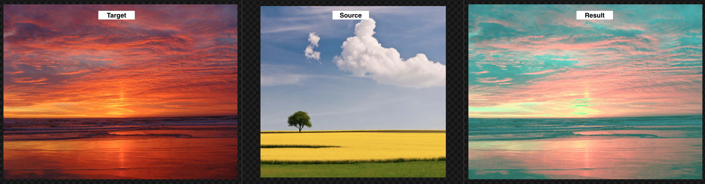
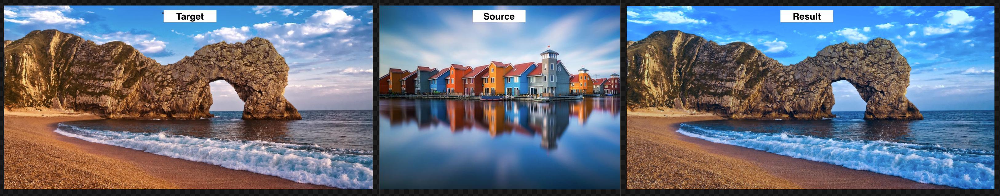
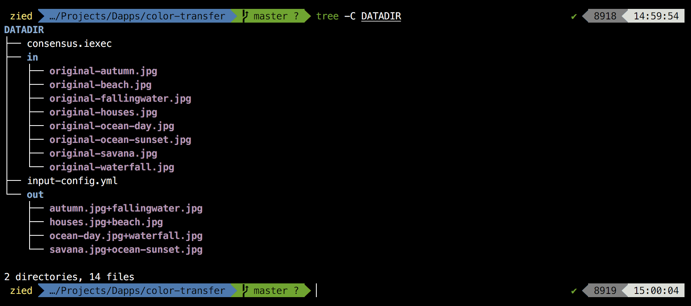

## Description
Credit: [pyimagesearch](https://www.pyimagesearch.com/2017/09/11/object-detection-with-deep-learning-and-opencv/)  
// TODO  
  
  
  


## Usage

Bring your images together in a folder (exp: DATADIR) and add an ```input-config.yml``` file which should contain this configuration:

    -
      source: <image-1>
      target: <image-2>
    -
      source: <image-1>
      target: <image-4>
    -
      source: <image-5>
      target: <image-6>


Run the script:

    $ git clone https://github.com/Zied-Guesmi/color-transfer.git && cd color-transfer/
    $ python3 app/src/app.py path/to/datadir (if empty it defaults to '/iexec')

The ```DATADIR/out/``` folder contains the new images.




## Dependencies

- [python3](https://www.python.org/)  
- [opencv](https://opencv.org/)
- [color_transfer](https://pypi.org/project/color_transfer/)

d
## Docker deployment

After installing [docker](https://docs.docker.com/install/) and preparing your DATADIR folder, just grab the docker image from dockerhub and run it:

    $ docker run -v abs/path/to/datadir:/iexec/ ziedguesmi/color-transfer

Or you can build your own image from dockerfile:

    # clone the dapp
    $ git clone https://github.com/Zied-Guesmi/color-transfer.git && cd color-transfer/

    # build the docker image
    $ docker build -t color-transfer .

    # run the container
    $ docker run -v abs/path/to/datadir:/iexec/ color-transfer


## Installation

Install system dependencies:

    # ubuntu as an example
    $ apt-get update && apt-get install -y \
        python3 \
        python3-pip

Clone the app:

    $ git clone https://github.com/Zied-Guesmi/color-transfer.git

Install python depedencies:

    $ cd color-transfer/
    $ pip3 install -r requirements.txt


## Authors

- **[Zied Guesmi](https://github.com/Zied-Guesmi)**


## License

This project is licensed under the MIT License - see the [LICENSE](https://github.com/Zied-Guesmi/color-transfer/blob/master/LICENSE) file for details.
